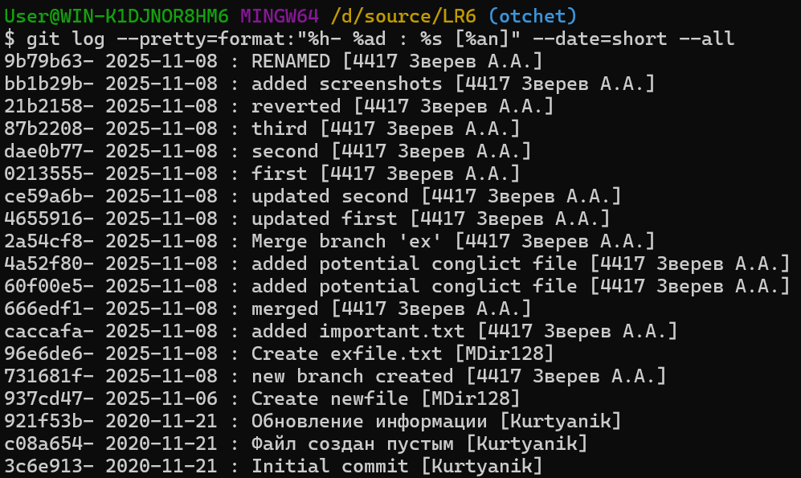
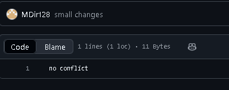
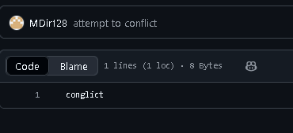
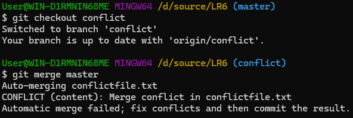
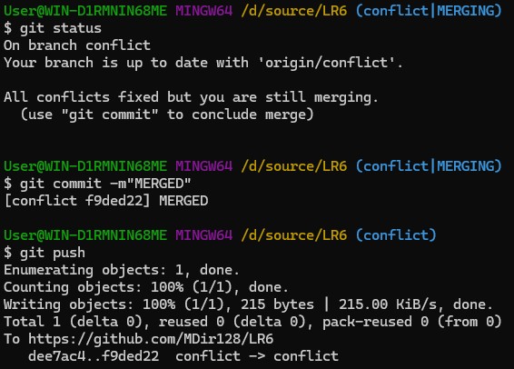

# LR6
Лабораторная работа №6

Цель лабораторной работы: изучение базовых возможностей системы управления версиями, опыт работы с Git API, опыт работы с локальным и удалённым репозиторием.

1) После создания форка репозитория копируем его в локальный репозиторий, а также меняем в конфигурации имя и адрес почты

2) Создаем новую ветку, в ней файл, а затем высылаем это в репозиторий на гитхаб


3) Получаем историю коммитов ветки ex

4) получаем историю коммитор ветки master

5) После создания одновременных файлов в разных ветках, как разных так и одновременных, а потом и заполнения одного и того-же файла в разных ветках противоречивой информацией, конфликтов не произошло и git автоматически выбирал версию из master, потому на скриншоте только схематическое изображение коммитов

6) Была создана серия коммитов с тремя разными файлами


7) Был отменен предыдущий коммит (в результате чего git удалил новодобавленный файл), после чего новый коммит фактически отменил предыдущий

8) Получили красивый вид лога коммитов

9) Наконец сделал конфликто
создал изменения в одном файле, написав разные данные


попробовал сделать merge - выдало ошибку

заменил данные в ветке conflict, чтобы данные в файле соответствовали master. Сработало

# Лог коммитов (примерный)
```
git clone
git config user.name
git config user.email
git add
git commit -m
git push
git branch
git checkout
git push --set-ipstream origin 
git log master
git log ex
...попытки вызвать конфликт
git merge
git branch -d

echo " ">..file
add ..file
commit -m
push
x3
git revert HEAD
git status
git commit -m "reverted"
git push

$ git log --pretty=format:"%h- %ad : %s [%an]" --date=short --all
```
# Вывод
В данной лабораторной работе были изучены базовые возможности системы управления версиями, был получен опыт работы с Git Api и опыт работы с локальным и удаленным репозиторие, также был получен опыт работы с Markdown.
