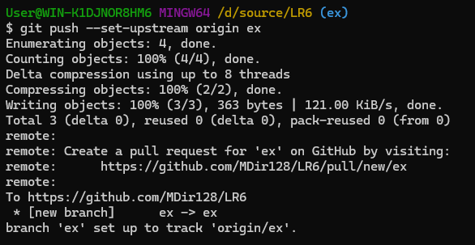
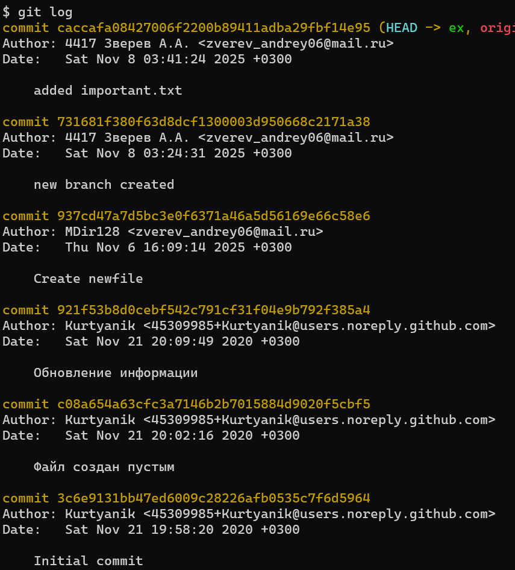
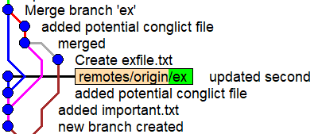
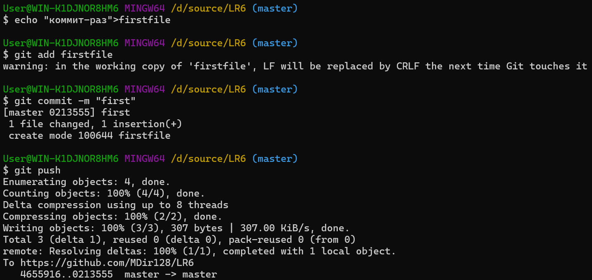
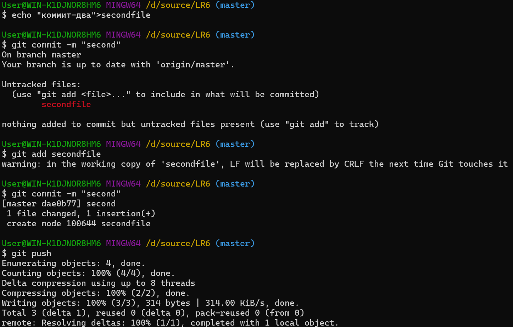
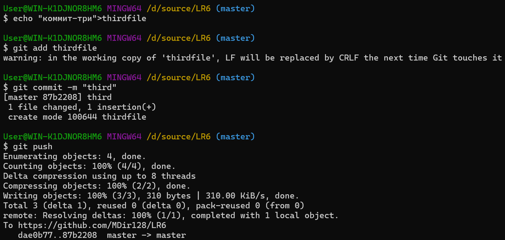
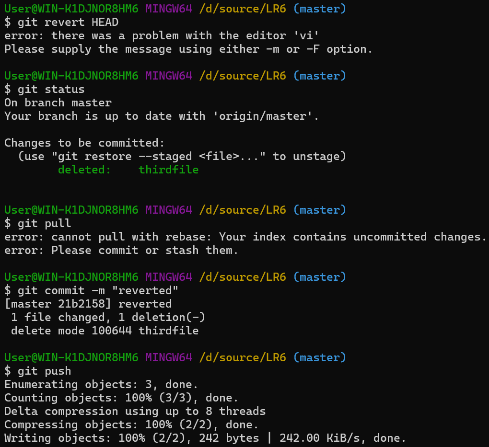

# LR6
Лабораторная работа №6

Цель лабораторной работы: изучение базовых возможностей системы управления версиями, опыт работы с Git API, опыт работы с локальным и удалённым репозиторием.

1) После создания форка репозитория копируем его в локальный репозиторий, а также меняем в конфигурации имя и адрес почты

2) Создаем новую ветку, в ней файл, а затем высылаем это в репозиторий на гитхаб

3) Получаем историю коммитов ветки ex

4) получаем историю коммитор ветки master

5) После создания одновременных файлов в разных ветках, как разных так и одновременных, а потом и заполнения одного и того-же файла в разных ветках противоречивой информацией, конфликтов не произошло и git автоматически выбирал версию из master, потому на скриншоте только схематическое изображение коммитов

6) Была создана серия коммитов с тремя разными файлами

7) Был отменен предыдущий коммит (в результате чего git удалил новодобавленный файл), после чего новый коммит фактически отменил предыдущий

